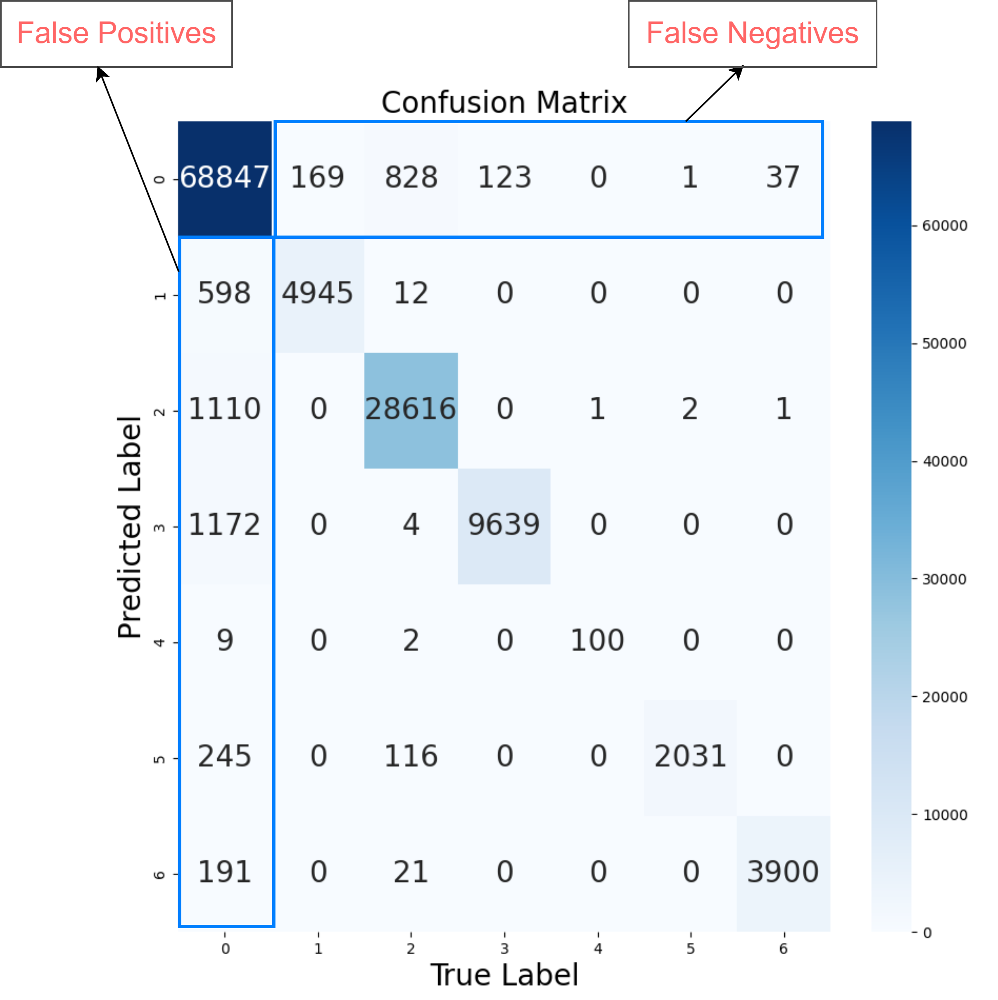

# Deep Learning based Risk Assessment for Franka Emika Panda Manipulator

This repository contains the code for trainng and evaluating the risk assessment model for Franka Emika Panda Manipulator.

#### Requirements
Before running the script, make sure the requirements are met by installing from requirements.txt using  
```pip install -r requirements.txt```

## Prerequisites

Prepare the dataset running the [preprocess.py](./preprocess.py) script.  
```python3 preprocess.py```

## How to run the code

- Make sure the [config.py](./config.py) is updated with the correct paths for the dataset, select the model, set the hyperparameters, choose the path to save the model and images.
- To train the model from scratch, set `train_flag = "fresh"` in [config.py](./config.py)
- To resume training from a checkpoint, set `train_flag = "continue"` in [config.py](./config.py)
- To evaluate the model, set `train_flag = "eval"` in [config.py](./config.py)

run [main.py](./main.py) using  
```python3 main.py```

## Hyperparameter tuning

The hyperparameters can be tuned using [hptune.py](./hptune.py) script.  
```python3 hptune.py```

Note: This uses wandb for logging the results. Make sure to set the `API_key` in terminal before running. Follow instructions [here](https://wandb.ai/quickstart?utm_source=app-resource-center&utm_medium=app&utm_term=quickstart)

## Results

- Hyperparameters tuning results


- Classification report for ST-GAT model

|     Class     | Precision |  Recall  | F1-Score | Support |
|---------------|-----------|----------|----------|---------|
|     no fe     |   0.98    |   0.95   |   0.97   |  72,172 |
|   ctrl fail   |   0.89    |   0.97   |   0.93   |  5,114  |
|    crit acc   |   0.96    |   0.97   |   0.96   |  29,599 |
|   pick fail   |   0.89    |   0.99   |   0.94   |  9,762  |
|    rel fail   |   0.90    |   0.99   |   0.94   |   101   |
|   collision   |   0.85    |   1.00   |   0.92   |  2,034  |
|     thrown    |   0.95    |   0.99   |   0.97   |  3,938  |
|   Accuracy    |           |          |   0.96   | 122,720 |
|   Macro Avg   |   0.92    |   0.98   |   0.95   | 122,720 |
| Weighted Avg  |   0.96    |   0.96   |   0.96   | 122,720 |

- Confusion Matrix



| False positive rate | False negative rate |
|---------------------|---------------------|
|        4.6%         |       1.654%        |

