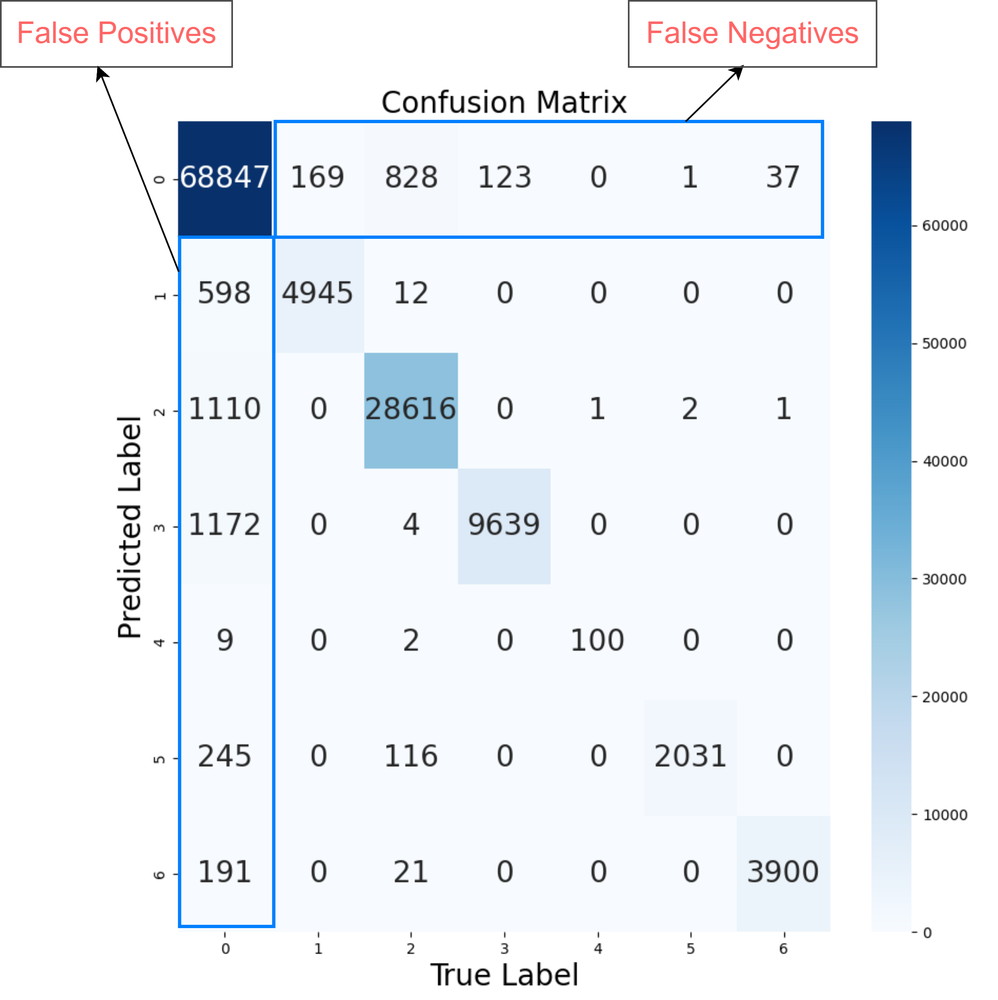

# Deep Learning based Risk Assessment for Franka Emika Panda Manipulator

[](https://deepwiki.com/s1mhadri/DeLeRA)

This repository contains the implementation of DeLeRA (Deep Learning-based Risk Assessment), a framework designed to identify and classify operational faults in the Franka Emika Panda manipulator using spatio-temporal deep learning models. By representing the robotic arm as a graph and analyzing joint-state dynamics, DeLeRA provides high-accuracy risk assessment across various failure modes.

## Getting Started

### Installation

Install dependencies via 
```sh
pip install -r requirements.txt
```

### Preprocessing

Prepare the dataset by converting raw bag files into a usable format.  
```sh
python3 preprocess.py
```

### Configuration

Adjust [config.py](./config.py)
- Set your desired model (e.g., STGATLSTM)
- To train the model from scratch, set `train_flag = "fresh"`.
- To resume training from a checkpoint, set `train_flag = "continue"`.
- To evaluate the model, set `train_flag = "eval"`.
- Choose the path to save the model and output images.

### Execution

Run using
```sh
python3 main.py
```

## Hyperparameter tuning

The hyperparameters can be tuned using [hptune.py](./hptune.py) script.  
```sh
python3 hptune.py
```

Note: This uses [wandb](https://wandb.ai/site/) for logging the results. Make sure to set the `API_key` in terminal before running. Follow instructions [here](https://wandb.ai/quickstart?utm_source=app-resource-center&utm_medium=app&utm_term=quickstart)

## Results

- Hyperparameters tuning results


- Classification report for ST-GAT model

|     Class     | Precision |  Recall  | F1-Score | Support |
|---------------|-----------|----------|----------|---------|
|     no fe     |   0.98    |   0.95   |   0.97   |  72,172 |
|   ctrl fail   |   0.89    |   0.97   |   0.93   |  5,114  |
|    crit acc   |   0.96    |   0.97   |   0.96   |  29,599 |
|   pick fail   |   0.89    |   0.99   |   0.94   |  9,762  |
|    rel fail   |   0.90    |   0.99   |   0.94   |   101   |
|   collision   |   0.85    |   1.00   |   0.92   |  2,034  |
|     thrown    |   0.95    |   0.99   |   0.97   |  3,938  |
|   Accuracy    |           |          |   0.96   | 122,720 |
|   Macro Avg   |   0.92    |   0.98   |   0.95   | 122,720 |
| Weighted Avg  |   0.96    |   0.96   |   0.96   | 122,720 |

- Confusion Matrix



| False positive rate | False negative rate |
|---------------------|---------------------|
|        4.6%         |       1.654%        |

